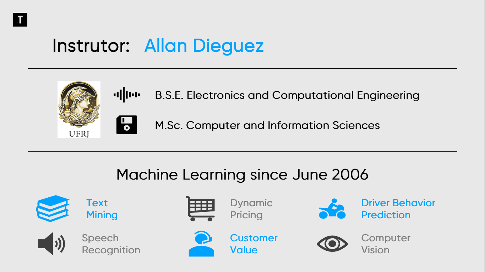

# Visualização de dados com matplotlib
Material da aula 10.

## Informações do Instrutor

* E-Mail: `allandieguez@gmail.com`
* Slack: `@allandieguez`
* LinkedIn: `https://www.linkedin.com/in/allan-dieguez-a05a741b`

## Material de referência

### Pré-Aula:
1. Tutoriais: Estudar todos os tutoriais na pasta `Pré-Aula`, executando linha a linha e levantando dúvidas para serem tiradas em aula. A aula será focada na solução de desafios e espera-se que todos os alunos já tenham estudado o material previamente.

2. Introdução às Libs:
	- Matplotlib: 
		- Homepage: https://matplotlib.org/
		- Examples: https://matplotlib.org/examples/
	- Seaborn:
		- Homepage: https://seaborn.pydata.org/
		- Examples: http://seaborn.pydata.org/examples/
		- Tutorial: https://seaborn.pydata.org/tutorial.html
3. Correlação de Pearson:
	- Conceitos: https://pt.wikipedia.org/wiki/Correla%C3%A7%C3%A3o
	- Visualização: http://rpsychologist.com/d3/correlation/     
4. Distribuição Normal
	- Distribuição Normal: https://en.wikipedia.org/wiki/Normal_distribution
	- Outliers: https://en.wikipedia.org/wiki/Outlier
5. Números Aleatórios:
	- Implementação do Numpy: https://docs.scipy.org/doc/numpy/reference/routines.random.html
	- Funções:
		- `seed`: https://docs.scipy.org/doc/numpy/reference/generated/numpy.random.seed.html#numpy.random.seed
		- `rand`: https://docs.scipy.org/doc/numpy/reference/generated/numpy.random.rand.html#numpy.random.rand
		- `randn`: https://docs.scipy.org/doc/numpy/reference/generated/numpy.random.randn.html#numpy.random.randn
6. Probabilidade: 
	- Distribuição Normal: https://en.wikipedia.org/wiki/Normal_distribution
	- Percentil: http://www.statisticshowto.com/probability-and-statistics/percentiles-rank-range/
	- Outliers: https://en.wikipedia.org/wiki/Outlier
7. Logaritmos: https://pt.wikibooks.org/wiki/Matem%C3%A1tica_elementar/Logaritmos

### Pós-Aula:
1. Desafios Extras: dois desafios extras na pasta Pós-Aula.
2. Exemplos do Scikit-Learn: http://scikit-learn.org/stable/auto_examples/index.html
3. Exemplos  no Blog do Kaggle:
	- Homepage: http://blog.kaggle.com
	- Case 1: http://blog.kaggle.com/2017/04/10/exploring-the-structure-of-high-dimensional-data-with-hypertools-in-kaggle-kernels
	- Case 2: http://blog.kaggle.com/2016/11/17/painter-by-numbers-competition-1st-place-winners-interview-nejc-ilenic
4. Visualização com Bokeh: https://www.datacamp.com/courses/interactive-data-visualization-with-bokeh
5. Métricas de Comparação de Séries: 